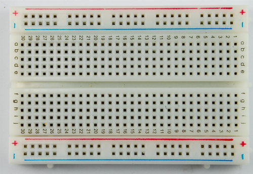

# Breadboard Simulator
  
This application allows you to simulate a breadboard on your computer.
A breadboard is a board that can be used to prototype and experiment with electric circuits.
As you can see above, a breadboard contains many holes. In each hole, you can connect electronic components like wires, resisters, leds, and switches in order to make a complete circuit.
The image below shows the connections beneath the breadboard's surface. You can see individual red, blue, and green lines.
By connecting these lines together with wires, leds, etc, you can create a complete circuit.
Because of this, breadboards are very versatile, and you can use it to try to experiment with many cool things!  
  
Below you can see what the breadboard will look like when the simulator first opens.  
  
To start, simply click on one of the five components below- a wire, resistor, led, switch, or power supply (required for a circuit).
Then enter the column (numbers on top and bottom) and row (letters on left and right), and the other applicable properties (like voltage or color)
Once you have placed all your components, press run and see your creation come to life.